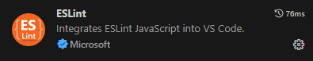
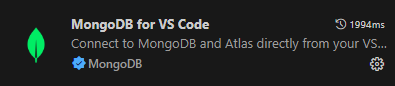

# **VBG_TDEA**
This repository contains the code for a comprehensive case management system designed to track and manage cases related to gender-based violence at Tecnológico de Antioquia. The system facilitates the reporting, tracking, and resolution of VBG cases, ensuring a structured and secure process for both administrators and users.

# **Authors**
- Karen Holguín Jaramillo
- Mayerli Giraldo Bermudez


# **Installation Manual for VBG Project**

## **Project Information**

- **Project Name**: VBG Project
- **Frontend Directory**: `vbg_tdea_front`
- **Backend Directory**: `vbg_project`
- **Database**: MongoDB
- **Event Streaming**: Kafka
- **Backend Framework**: Node.js with Express
- **Frontend Framework**: React
- **Authentication**: JWT and OAuth2.0 with Azure AD
- **Documentation**: Swagger (for API documentation)

---

## **Technologies Used**

- **Frontend**: React, Tailwind CSS, Bootstrap, Axios, FontAwesome
- **Backend**: Node.js, Express, Mongoose, KafkaJS
- **Authentication**: `@azure/msal-browser`, `@azure/msal-node`, `@azure/msal-react`, `passport-azure-ad`
- **Database**: MongoDB (NoSQL database)
- **Event Messaging**: Confluent Kafka (using `kafka-node` for connection)

---

## **Project Structure**

### Backend (`vbg_project` Directory)

- `src/index.js`: Main entry point of the backend server.
- `src/routes`: Defines API routes.
- `src/controllers`: Contains logic for handling API requests.
- `src/models`: Defines Mongoose models for MongoDB collections.
- `src/services`: Business logic and helper functions.
- `src/middleware`: Middleware like `authenticateToken` for route protection.
- `src/kafka`: Producer and consumer configurations and message handling.

### Frontend (`vbg_tdea_front` Directory)

- `public`: Contains static assets.
- `src/index.jsx`: Main entry point of the React application.
- `src/components`: UI components.
- `src/pages`: Main pages of the application.
- `src/styles`: CSS and Tailwind configuration for styling.
- `src/services`: API service calls using Axios.
- `src/auth`: Auth utilities to handle user authentication.

---

## **Set Up Development Environment**

1. **Install Node.js**: Ensure you have [Node.js](https://nodejs.org/en/download/) installed (version 18.x or higher).
2. **Install MongoDB**: Set up [MongoDB](https://www.mongodb.com/try/download/community) on your local machine or use a managed MongoDB service (e.g., MongoDB Atlas).
3. **Set Up Kafka**:
   - Use Confluent Cloud for a managed Kafka service or install Kafka locally.
   - Configure Kafka topics as required: `ticket-created`, `ticket-status-changed`, `ticket-historico-changed`.

4. **Install VSCode** (recommended): Download and install [VSCode](https://code.visualstudio.com/).
5. **Install Recommended VSCode Plugins**:
   - **ESLint**: For linting and code quality.
   - **MongoDB for VSCode**: For MongoDB integration. 

    
    

---

## **Installation Steps**

### 1. **Clone the Repository**

   ```bash
   git clone <your-repo-url>
   cd <your-repo-directory>
   ```

### 2. **Set Up the Backend**

1. **Navigate to the Backend Directory**:

   ```bash
   cd vbg_project
   ```

2. **Install Dependencies**:

   ```bash
   npm install
   ```

3. **Set Up Environment Variables**:
   - Create a `.env` file in the `vbg_project` directory.
   - Add the following environment variables:

     ```plaintext
     PORT=3000
     MONGO_URI=<Your MongoDB URI>
     ENCRYPTION_KEY=<Your Encryption Key>
     FRONTEND_URL=http://localhost:3001
     KAFKA_BROKER=<Your Kafka broker URL>
     KAFKA_USERNAME=<Your Kafka Username>
     KAFKA_PASSWORD=<Your Kafka Password>
     # Kafka Topics (customize as needed)
     KAFKA_TOPIC_TICKET_CREATED=ticket-created
     KAFKA_TOPIC_TICKET_STATUS_CHANGED=ticket-status-changed
     KAFKA_TOPIC_TICKET_HISTORICO_CHANGED=ticket-historico-changed
     ```
     > **Note**: Update `ENCRYPTION_KEY` with a secure key. Adjust `KAFKA` variables to match your Confluent Cloud or Kafka setup.

4. **Start the Backend Server**:

   ```bash
   npm run start
   ```

5. **Check Swagger Documentation**:
   - The Swagger API documentation should be available at `http://localhost:3000/api-docs`.

### 3. **Set Up the Frontend**

1. **Navigate to the Frontend Directory**:

   ```bash
   cd ../vbg_tdea_front
   ```

2. **Install Dependencies**:

   ```bash
   npm install
   ```

3. **Set Up Environment Variables**:
   - Create a `.env` file in the `vbg_tdea_front` directory.
   - Add the following environment variables:

     ```plaintext
     PORT=3001
     REACT_APP_AZURE_CLIENT_ID=<Your Azure Client ID>
     REACT_APP_AZURE_AUTHORITY=https://login.microsoftonline.com/<YourTenantID>
     REACT_APP_API_BASE_URL=http://localhost:3000
     REACT_APP_REDIRECT_URI=http://localhost:3001
     ```
     > **Note**: Replace `YourAzureClientID` and `YourTenantID` with your Azure AD details.

4. **Start the Frontend Server**:

   ```bash
   npm run start
   ```

   The frontend application should be accessible at `http://localhost:3001`.

### 4. **Kafka Configuration**

1. **Create Topics**: Make sure the topics `ticket-created`, `ticket-status-changed`, and `ticket-historico-changed` are created in your Kafka cluster.
2. **Consumer and Producer**: The backend `vbg_project` has a Kafka producer and consumer configured to listen to these topics and handle email notifications.

### 5. **Testing the Application**

- **Access the Application**: Open `http://localhost:3001` in your browser to access the frontend.
- **Testing API Endpoints**: Use a tool like Postman or the VSCode REST Client to test the backend API endpoints.

---

## Additional Configuration for Kafka

1. **Confluent Cloud Dashboard**: In the Confluent Cloud Console, you can monitor the message consumption, errors, and configuration details for your Kafka topics.
2. **Kafka Setup**: Ensure you have the correct permissions set for topics in Confluent Cloud and that the credentials in the `.env` file match your setup.

---

## **Troubleshooting**

- **MongoDB Connection Issues**: Verify your MongoDB URI and ensure MongoDB is running.
- **Kafka Errors**: If you encounter partition or topic errors, confirm the topics are created and properly configured in Confluent Cloud.
- **Environment Variable Issues**: Double-check all `.env` variables in both the frontend and backend directories.
